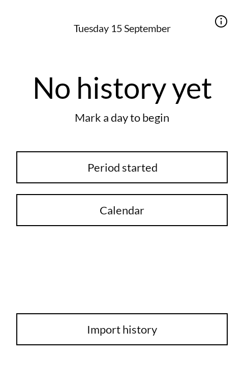
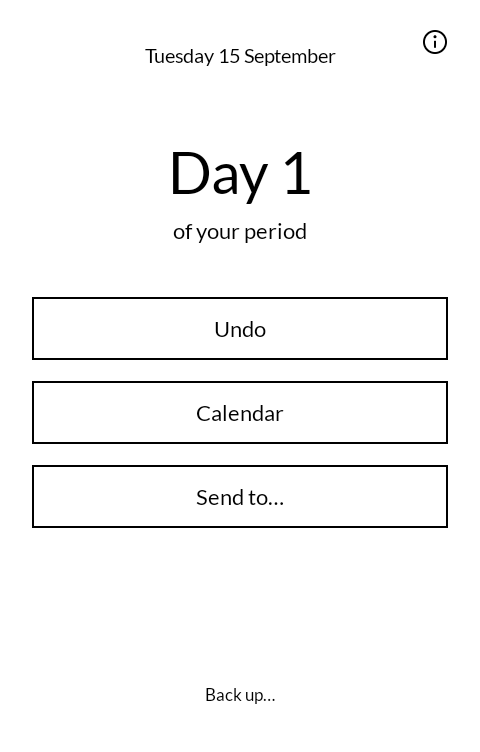
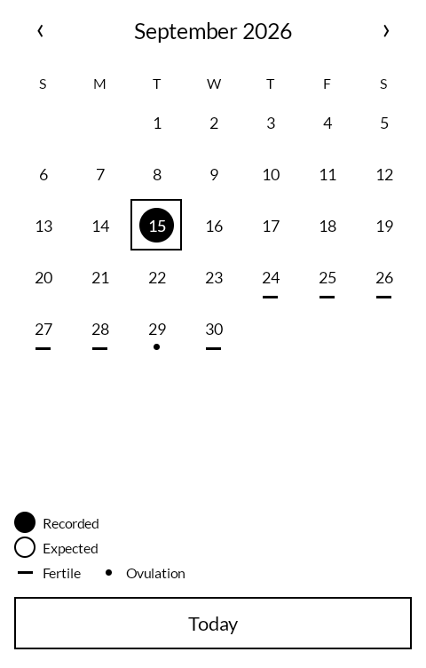
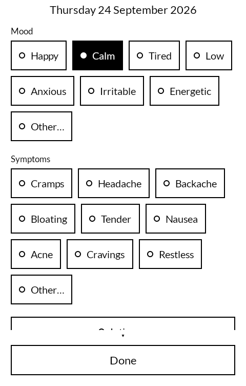

# cycle

A cycle tracker for the Mudita Kompakt. Written from scratch.

It has no permissions. There is no `INTERNET` line in the manifest and there is not going to be,
so what is recorded here has no mechanism by which to leave the phone.

| | |
|---|---|
|  |  |
|  |  |

## Where it came from

Not a fork. The behaviour follows Period Tracker (GP International LLC), which is proprietary and
has no source to derive from; it was matched by using the running app, not by reading it.

## Building

    ./gradlew :app:assembleDebug
    ./gradlew :app:testDebugUnitTest

## Getting it, and keeping it

Download <https://github.com/wanderwildwood/cycle/releases/latest/download/cycle.apk> and
sideload it. That address always points at the newest release, and every release publishes a
`.sha256` beside the APK if you would rather check than trust.

For updates without doing this by hand, add this repository to
[Obtainium](https://github.com/ImranR98/Obtainium):

    https://github.com/wanderwildwood/cycle

It will offer each new release as it appears. **The application id is settled** — updates
install over what you have, keeping your settings and anything the app has stored.

## How a period is recorded

Every day is confirmed by hand. Period Tracker fills in the days after a start on its own, from the
average period length; this does not, and will not — a day it filled in would be a day it invented,
sitting in the record looking exactly like a day you reported.

Nothing ends a period either. There is no button for it. You confirm each day it is still going,
and when you stop confirming, it stops on its own two days later. That span is the same one the
grouping tolerates, so a day confirmed late still joins the period rather than starting a new one,
and it is the reason a single forgotten tap costs nothing.

## Licence

GPL-3.0-only. See [LICENSE](LICENSE).

Copyright (C) 2026 wander wildwood

This program is free software: you can redistribute it and/or modify it under the terms of the GNU
General Public License, version 3, as published by the Free Software Foundation.

This program is distributed in the hope that it will be useful, but WITHOUT ANY WARRANTY; without
even the implied warranty of MERCHANTABILITY or FITNESS FOR A PARTICULAR PURPOSE. See the GNU
General Public License for more details.

Version 3 only, not "or later": nothing here can be moved onto a licence that has not been written
yet.

Nothing forced that choice. This is not a fork, and every dependency is permissive — AndroidX,
Compose and Room are all Apache-2.0. It is copyleft because of what the app holds. The whole design
is that the record has no way off this phone that you do not take yourself; a permissive licence
would let someone ship this same code with telemetry added and never publish a line of it. Copyleft
is the part of that design that survives the code leaving here.

Lato keeps its own licence — SIL Open Font License 1.1, `LICENSES/OFL-1.1.txt`.
